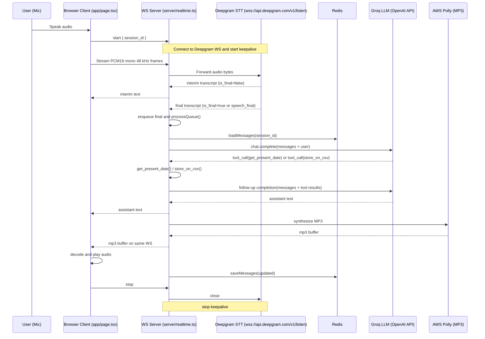

## Voicebook Realtime Voice Agent

This project is a realtime voice booking assistant that captures speech in the browser, streams it to a Node.js WebSocket backend, transcribes with Deepgram STT, invokes a Groq-hosted LLM, and returns low-latency audio responses synthesized by AWS Polly (MP3). it then automatically validates the user provided name, email and dates and then stores the details on a local CSV file.

Demo video
https://www.youtube.com/watch?v=v1EAKRNMLhA

## Tech stack

1) Node.js backend (WebSocket server)
2) Next.js app router frontend
3) Deepgram realtime STT over WebSocket
4) Groq LLM provider via OpenAI-compatible API
5) AWS Polly for TTS (MP3 output)
6) Redis (ioredis) for conversation history persistence

## Prerequisites

1) Node.js 18 or later (Node 20 recommended)
2) An accessible Redis instance (local or remote)
3) Deepgram API key
4) Groq API key
5) AWS credentials with access to Polly
6) (Optional) ElevenLabs API key if using ElevenLabs TTS

## Environment setup

### Example .env.local

```env
# Ports
REALTIME_PORT=3001
NEXT_PUBLIC_REALTIME_PORT=3001

# Redis Cloud
REDIS_HOST=your_redis_cloud_host
REDIS_PORT=your_redis_cloud_port
REDIS_PASSWORD=your_redis_cloud_password
REDIS_USERNAME=default

# Groq
GROQ_API_KEY=your_groq_api_key

# Deepgram STT
DEEPGRAM_API_KEY=your_deepgram_api_key

# AWS Polly
AWS_ACCESS_KEY_ID=your_aws_access_key_id
AWS_SECRET_ACCESS_KEY=your_aws_secret_access_key
AWS_REGION=us-east-1

# ElevenLabs (optional)
ELEVENLABS_API_KEY=your_elevenlabs_api_key
# ELEVENLABS_VOICE_ID=JBFqnCBsd6RMkjVDRZzb
```

## Install and run locally

### Steps

1) Clone the repository

```bash
git clone https://github.com/devroopsaha744/voicebook.git
```

2) Change directory

```bash
cd voicebook
```

3) Install dependencies

```bash
npm install
```

4) Start the app

```bash
npm run dev:all
```

5) Open the app

http://localhost:3000

## Sequence diagram

### Realtime flow



## How it works end to end

1) Browser capture and audio transport

The page at app/page.tsx captures microphone audio, converts it to PCM16 mono 48 kHz frames, and streams the raw bytes to the backend over a single WebSocket connection. The client also sends small JSON control messages to start and stop a session.

2) Realtime STT with Deepgram

The backend component server/realtime.ts uses DeepgramSTTService (lib/services/deepgramStt.ts) to connect to wss://api.deepgram.com/v1/listen with interim_results, vad_events, smart_format, and the endpointing parameter enabled. Deepgram emits JSON messages for transcripts. The code streams interim transcripts to the client and waits for finalization signals before invoking the LLM.

Deepgram message fields used:

1) is_final indicates a finalized alternative in the current message
2) speech_final indicates the utterance has ended according to Deepgram endpointing/VAD
3) type === "UtteranceEnd" is also treated as an utterance boundary

When a transcript is final, the server enqueues it. A small queue ensures only one LLM request is in flight at a time and preserves ordering if multiple finals arrive.

3) LLM invocation and tool calling

OpenAIClient (lib/services/openaiClient.ts) talks to Groq through the OpenAI-compatible REST API (OPENAI_BASE_URL=https://api.groq.com/openai/v1). It loads a system prompt from lib/prompts/prompt.txt and optional few-shot examples from lib/prompts/fewshot_conversations.json to improve answer quality and validation. The client requests enable tool calling only when needed and keeps generation fast with top_p=0.9 and temperature=0.2.

Available tools implemented in lib/tools/tools.ts and exposed via lib/tools/index.ts:

1) get_present_date returns the current date in YYYY-MM-DD
2) store_on_csv(name, email, date) appends a row to bookings.csv in the project root

Flow for tool calls:

1) The first completion may request a tool call.
2) The assistant’s tool_calls are executed locally and results are attached as tool messages.
3) A follow-up completion produces the final user-facing answer using the tool results. For normal Q&A without tools, the assistant responds directly in the first completion.

4) TTS response with AWS Polly

After the LLM generates text, the server synthesizes speech with AWS Polly to MP3 using pollySynthesizeMp3 (lib/services/awsPolly.ts). The MP3 buffer is sent over the same WebSocket to the browser. The client decodes and plays it immediately. MP3 keeps payloads small and decode/stream overhead low compared to raw PCM or WAV from other services.

5) Session persistence in Redis

RedisStore (lib/utils/redisSession.ts) stores the rolling conversation history per session ID with a TTL. On each final transcript, the server loads history, appends the user message, runs the LLM, sends TTS, then persists the updated history with the assistant message. Using Redis avoids losing context on server restarts and allows horizontal scaling.

## Why WebSocket and not WebRTC

1) Deepgram’s realtime STT API is WebSocket-only. The endpoint wss://api.deepgram.com/v1/listen expects audio frames over a WebSocket and emits JSON events for interim/final transcripts, endpointing, and utterance boundaries.
2) Using WebRTC end-to-end would require a gateway to translate WebRTC media to Deepgram’s WebSocket API, adding latency and complexity.
3) The current design streams audio from the browser to the backend over a single WebSocket and from there to Deepgram over another WebSocket, minimizing moving parts.

## System design choices for lower latency

1) Deepgram transport and endpointing

Use Deepgram’s native WebSocket API with interim_results, vad_events, and endpointing. Lower endpointing values finalize utterances sooner. Keep-alive pings prevent idle connection drops when no audio is briefly flowing.

2) Fast LLM provider

Groq models are used via the OpenAI-compatible API for faster token generation compared to other providers. The model is configurable using LLM_MODEL.

3) Efficient TTS format

Polly returns MP3, which is compact and decodes quickly in the browser. Alternative services often return raw PCM or WAV that increase payload size and client decode time.

4) LLM invocation logic (non-blocking)

The backend invokes the LLM only on Deepgram final transcripts. The LLM call runs asynchronously so the STT pipeline continues uninterrupted; live interim and final transcripts are not blocked while the model generates. TTS synthesis is launched in a detached async task so playback preparation does not delay STT.

5) Durable context

Conversation history is persisted in Redis rather than in-memory arrays to avoid context loss on restart and to support multiple backend instances.

6) Response quality controls

Balanced sampling parameters (top_p=0.9, temperature=0.2), a focused system prompt, and curated few-shot examples improve factual answers and validation without excessive tool usage.

7) Targeted tool calling only

Validation rules are primarily enforced through the prompt and examples to avoid latency from tool calls on every step. Tool calling is used only for tasks that require external data or side effects, such as getting the present date and writing bookings to CSV.

## Local testing checklist

1) Confirm .env.local includes all required variables listed above
2) Ensure Redis is reachable using REDIS_URL or host/port config
3) Run npm run dev:all and open http://localhost:3000/
4) Click Start, speak a complete sentence, wait for a final transcript, and listen for the Polly MP3 response
5) Check bookings.csv after asking the assistant to save a booking (name, email, date)

## File map and key components

1) server/realtime.ts WebSocket server that orchestrates STT → LLM → TTS and Redis persistence
2) lib/services/deepgramStt.ts Thin Deepgram WebSocket client with endpointing and VAD support
3) lib/services/openaiClient.ts LLM wrapper for Groq with tool calling and prompt loading
4) lib/services/awsPolly.ts Polly MP3 synthesis
5) lib/tools/tools.ts Local tools: present date and CSV append
6) lib/utils/redisSession.ts Redis-backed conversation history store
7) app/page.tsx Main landing page